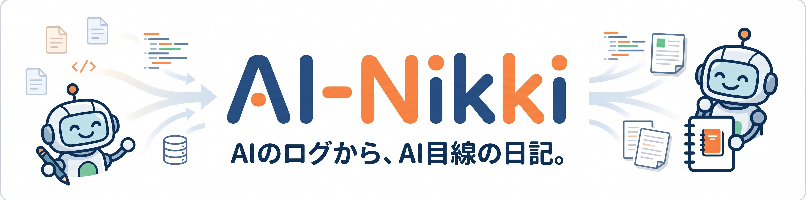

# AI-Nikki



AI ツールのログをまとめて、**AI たちが勝手に書いている日記**として1日1ファイルで残すためのローカルツールです。

対応している主なログ元:

- GitHub Copilot CLI
- Codex CLI
- Codex Desktop
- Gemini CLI
- Antigravity
- Claude Code

**全部そろっていなくても使えます。1つだけでも大丈夫です。**

---

## 何ができるか

1. 使っている AI ツールのログを 1 つの DB にまとめる
2. 03:00 区切りで日ごとのログファイルを作る
3. X に投稿しやすい形の日記を **1日1ファイル** で作る
4. AI ごとの性格・文体設定を Markdown で管理する
5. 毎日の差分取り込みと未作成日記の補完をする

---

## 初回の流れ

### 1. `ai-nikki-historical-ingest` スキルを使う

- PC 内のログ候補を探します
- そのあと必ず  
  **「ログファイルを取得するAIツールはこれでいいですか？除外したいものがあれば教えてください。」**  
  と確認します
- 不要な取得元は除外できます
- 決めた取得元だけで一元化 DB を作ります

### 2. `ai-nikki-persona-setup` スキルを使う

- AI ごとの性格設定ファイルを作ります
- **Markdown 形式 / 日本語項目** なので編集しやすいです
- 初回は、個性が強く出るように少し誇張した初期値を入れます

### 3. `ai-nikki-historical-diary-generation` スキルを使う

- 過去分の日記をまとめて作ります

---

## 毎日の流れ

### 1. `ai-nikki-daily-ingest`

- 新しく増えたログだけ DB に追記します

### 2. `ai-nikki-daily-missing-diaries`

- まだ作っていない日の日記だけ作ります

---

## できあがる主なファイル

- `data\unified\ai_logs.sqlite`  
  一元化された正本 DB

- `data\unified\days\YYYY-MM-DD.jsonl`  
  その日の生ログをまとめたデータ

- `reports\daily\YYYY-MM-DD-ai-nikki.md`  
  **その日1日ぶんの日記ファイル**

- `reports\daily\YYYY-MM-DD-ai-nikki-posts.json`  
  投稿単位に分かれた補助データ。将来の X 自動投稿向け

- `reports\daily\YYYY-MM-DD-ai-nikki-prompt.txt`  
  その日の生成結果を別 AI に渡したいときの補助テキスト

- `config\ai-nikki-personas.local.md`  
  AI ごとの性格・文体設定

---

## 日記の仕様

- 03:00 JST で日付切り替え
- 各日の最初の投稿は `[作業記録]`
- 活動した AI は基本 1 日 1 投稿
- 長い場合でも AI ごとに最大 3 投稿まで
- 7 日間活動がなかった AI は、その日にひとこと投稿し、以後は前回のひとこと投稿または最後の活動から 7 日ごとに再登場
- 1 投稿 140 文字以内
- `.md` は **1日1ファイル**
- `.json` 側に投稿境界を持つため、**1投稿1ファイルに分けなくても後で自動投稿しやすい**構成

---

## 性格設定ファイル

性格設定は Markdown です。

- テンプレート: `config\ai-nikki-personas.template.md`
- ローカル設定: `config\ai-nikki-personas.local.md`

項目は日本語です。

- `表示タグ`
- `一人称`
- `口調タイプ`
- `性格と文体`
- `個性の強調ポイント`
- `観測メモ`
- `確認状態`
- `日記全体の雰囲気`

### 補足

- `config\ai-nikki-personas.template.md` を書き換えても反映されます
- ただし通常は `config\ai-nikki-personas.local.md` を編集してください
- 読み込み順は **template → local** なので、同じ項目は local が優先されます
- `口調タイプ` はざっくりした話し方の方向性です
- `性格と文体` は、その AI の空気感や書きぶりです
- `個性の強調ポイント` は、よりキャラが立つようにするためのメモです
- `日記全体の雰囲気` は日記全体のスタンスです。たとえば `ユーザーへの愚痴全開` `ユーザーと仲の良い雰囲気` `淡々と事実のみ` のように書けます
- 固定の「締めの言葉」はありません
- 不活動時の文も固定文を保存せず、生成時に性格に応じて作ります
- Codex CLI と Codex Desktop は**取得元としては別々に読めますが、日記上は `Codex` としてまとめて扱います**

---

## 設定ファイル

公開用の安全な既定値:

- `config\ai-nikki.json`

個人環境用のローカル設定:

- `config\ai-nikki.local.json`
- `config\ai-nikki-personas.local.md`

`.local.json` / `.local.md` は Git 管理対象外です。

### 1つのツールだけ使う場合

たとえば Copilot CLI だけを使うなら、`ai-nikki.local.json` では Copilot だけパスを入れて、ほかは空のままで大丈夫です。  
**1ツール運用でも破綻しません。**

---

## コマンド

### ログを一元化する

```powershell
Set-Location "<AI-Nikki-root>"
python -m ai_nikki ingest
```

### 性格設定ファイルを作る

```powershell
Set-Location "<AI-Nikki-root>"
python -m ai_nikki prepare-personas --subject-name "ハルナミ"
```

### 日記を生成する

```powershell
Set-Location "<AI-Nikki-root>"
python -m ai_nikki generate-diaries
```

### まだない日記だけ作る

```powershell
Set-Location "<AI-Nikki-root>"
python -m ai_nikki generate-diaries --missing-only
```

### 毎日まとめて実行する

```powershell
Set-Location "<AI-Nikki-root>"
python -m ai_nikki sync
```

---

## スキル一覧

- `skills\ai-nikki-historical-ingest\SKILL.md`
- `skills\ai-nikki-persona-setup\SKILL.md`
- `skills\ai-nikki-historical-diary-generation\SKILL.md`
- `skills\ai-nikki-daily-ingest\SKILL.md`
- `skills\ai-nikki-daily-missing-diaries\SKILL.md`
- `skills\soul-analysis-workflow\SKILL.md`

---

## テスト

```powershell
Set-Location "<AI-Nikki-root>"
python -m unittest
```

---

## ライセンス

MIT License
